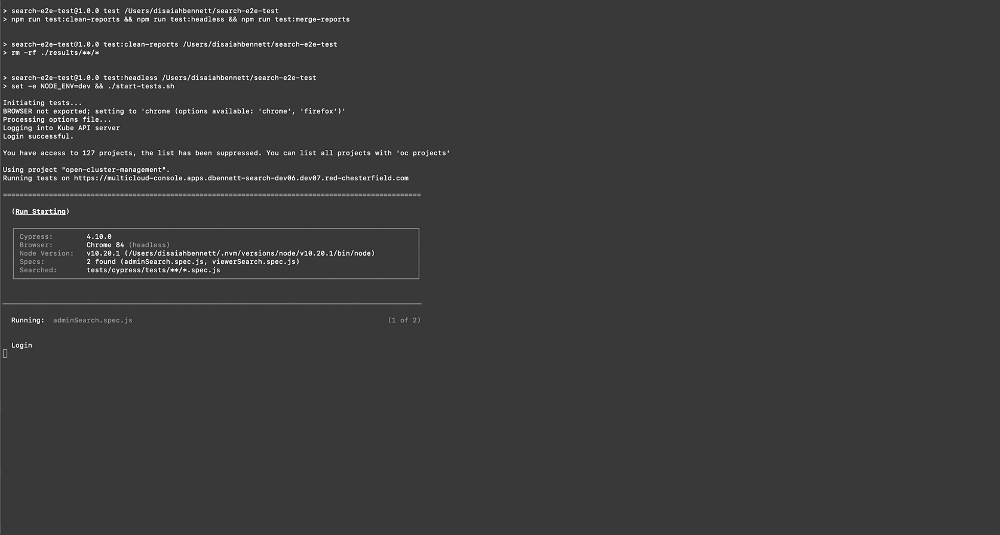

# search-e2e-test

End-to-end tests for the Open Cluster Management search component. The tests consist of the following user scenarios:

- [API tests](./tests/api/README.md)
- [UI tests](./tests/cypress/README.md)

## Running the tests locally

> Pre-requisites:
>
> - nodeJS
> - OpenShift CLI
> - yq command - [link](https://snapcraft.io/install/yq/fedora) for Fedora
> - a browser - either chrome or firefox

1. Copy the `options.yaml.template` file into `./options.yaml` and update with your target cluster access info.
2. Run `npm install`
3. Run `npm run test` OR `npm run test:headed`

## Running the tests using Docker image

1. Copy the `options.yaml.template` file into `./options.yaml` and fill in the necessary values.
2. Pull an existing image or build your own using `docker build -t <image_name>:<tag> .`
3. Run the image with the following command `docker run -it --volume $(pwd)/test-output:/results --volume $(pwd)/options.yaml:/resources/options.yaml <image_name>:<tag>`
   > **Alternative:** Pass the values in options.yaml as environment variables to the image like: `-e OPTIONS_HUB_BASEDOMAIN=${value}`

## NPM Commands

| Command                      | Description                                                                                    |
| ---------------------------- | ---------------------------------------------------------------------------------------------- |
| `npm run test`               | Run Cypress tests                                                                              |
| `npm run test:api`           | Run Search API tests (jest)                                                                    |
| `npm run test:clean-reports` | Remove reports within the results directory                                                    |
| `npm run test:debug`         | Remove reports within the results directory                                                    |
| `npm run test:headed`        | Run Cypress tests and display test being executed within the browser (Default browser: chrome) |
| `npm run test:headless`      | Run Cypress tests while hiding the browser                                                     |
| `npm run test:merge-json`    | Merge JSON report files within the results/json directory                                      |
| `npm run test:merge-reports` | Merge reports within the results directory                                                     |
| `npm run test:merge-xml`     | Merge XML report files within the results/xml directory                                        |
| `npm run test:production`    | Run Cypress tests in the production environment                                                |

## Links

These are a few useful links that will help provide technical reference and best practices when developing for the platform.

- [Cypress Docs](https://docs.cypress.io/guides/overview/why-cypress.html)
- [NPM Docs](https://docs.npmjs.com)

Rebuild: 9/22/2021
